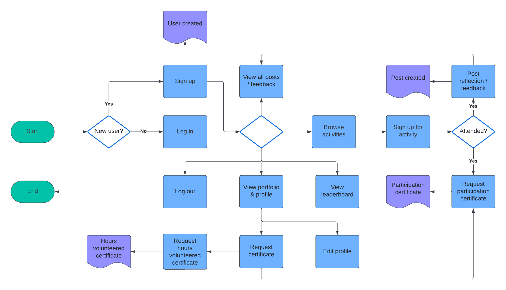

# Big Hearts Hub

### Overview

Big Hearts Hub is a comprehensive volunteer management solution tailored for "Big at Heart." Streamlining the entire volunteer lifecycle, our user-friendly platform simplifies enrollment, activity management, certificate requests, and real-time attendance tracking. Beyond the essentials, we enhance engagement and motivation through gamification, offering a fun and rewarding experience for volunteers. Additionally, Big Hearts Hub curates activities and recommends personalized opportunities, making each volunteer's experience more tailored and meaningful. The platform optimizes form handling, attendance records, and report generation, providing a holistic solution for efficient volunteer coordination within the "Big at Heart" community.

### Team Name

**MVC**: Make Volunteering Count

### Table of Contents

1. [Installation](#installation)
2. [Usage](#usage)
3. [Features](#features)
4. [Future Developments](#future-developments)
5. [Technologies Used](#technologies-used)
6. [Architecture](#architecture)
7. [Credits](#credits)

### Installation

**Online Deployment**

To access the deployed version of Big Hearts Hub, simply visit [Big Hearts Hub](https://bigheartshub.vercel.app).

**Local Setup**

Follow these steps to set up Big Hearts Hub locally on your machine:
1. Clone the Repository:

```
git clone https://github.com/ciaoosuuu/hack4good-2024.git
```

2. Navigate to the Project Directory:

```
cd hack4good-2024
```

3. Install Dependencies:

```
yarn install
```

4. Configure Environment Variables:

Create a `.env` file in the root directory and configure the necessary environment variables as per provided `.env` in Devpost.

5. Run the Application:

```
yarn dev
```

6. Access Big Hearts Hub:

Open your web browser and navigate to http://localhost:3000 to access the locally deployed instance of Big Hearts Hub.

**Demo User Accounts**

For demonstration purposes, two user accounts have been provided. You can opt to either create a new account or use the following login credentials:

- **Volunteer Account:**
  - **Email:** volunteer1@gmail.com
  - **Password:** 123456

- **Admin Account:**
  - **Email:** admin@gmail1.com
  - **Password:** 123456


### Usage

**Use Cases**


**User Flow**

Volunteer:



Admin:


### Features

**Volunteer Enrollment**: Big Hearts Hub simplifies the enrollment process for volunteers associated with "Big at Heart," fostering inclusivity and accessibility to a diverse range of potential contributors.

**Activity Management**: Volunteers can seamlessly browse, select, and manage their participation in various activities, while organizers within "Big at Heart" can efficiently plan and coordinate events, optimizing the overall volunteer experience.

**Certificate Requests**: Our platform empowers volunteers affiliated with "Big at Heart" to request certificates effortlessly, acknowledging their contributions and reinforcing a sense of accomplishment.

**Attendance Tracking**: Big Hearts Hub ensures real-time signups and attendance tracking, providing administrators at "Big at Heart" with a clear overview of volunteer participation, enhancing event management and resource allocation.

**Detailed Reports**: The application equips administrators of "Big at Heart" with a powerful reporting tool, enabling them to generate detailed reports on volunteer activities, demographics, and attendance, fostering informed decision-making.

**Reflections Gallery**: Volunteers can share their heartfelt thoughts, experiences, and reflections with the community through the "Blog" or “Reflections” feature. This addition fosters a sense of community and encourages knowledge-sharing among volunteers, enhancing the overall volunteering journey.

**Volunteer Portfolio**: Track and showcase one’s volunteer journey through the "Volunteer Portfolio." Keep a comprehensive record of each volunteer’s activities, posts, reflections, feedback, and hours volunteered. This feature allows volunteers to celebrate their impact and remember their inspiring journey.

**Gamified Experience**: Our platform recognizes and rewards volunteers with points, badges, or virtual rewards based on their commitment and consistency in volunteering. This gamified approach adds a fun element to the volunteering experience, encouraging sustained engagement.

**Activities Curation**: Big Hearts Hub intelligently matches volunteers with activities aligned with their interests and skills. By considering user preferences, the platform ensures a personalized volunteering experience, connecting volunteers with opportunities that resonate with their passions.

### Future Developments

**Recurring Activities Support**: Big Hearts Hub will enhance support for recurring activities, ensuring a streamlined experience for volunteers participating in ongoing events within "Big at Heart."

**Giving Activities Integration**: Big Hearts Hub will introduce support for "giving" activities like donation drives. This feature empowers volunteers to contribute meaningfully to fundraising efforts, fostering a culture of generosity in the "Big at Heart" community.

**Announcements Feature**: Big Hearts Hub is introducing an announcements feature, providing administrators with a dedicated space to share important updates, event details, and community news directly with volunteers, enhancing communication within the "Big at Heart" community.

**Missions for Gamified Experience**: Big Hearts Hub is introducing missions to elevate the gamified experience. Volunteers can embark on exciting missions tied to their journey, achievements, and participation milestones, adding a new layer of fun and accomplishment to the volunteering adventure in the "Big at Heart" community.

**Enhanced Recommendations**: Big Hearts Hub will sport more advanced machine learning algorithms to refine our activities recommendation system. This enhancement aims to provide volunteers with even more personalized and meaningful opportunities based on their interests and skills.

**On-the-Go Management for Administrators**: Our next phase involves optimizing the Big Hearts Hub web app for responsiveness, ensuring administrators and organizing teams can efficiently manage activity logistics from the convenience of their phones.

**Enhanced Report Customizability**: The customizability of our reports will be expanded to offer more detailed analysis options. This future development enables administrators to tailor reports to their specific needs, facilitating strategic decision-making and fostering a data-driven approach to volunteer management within "Big at Heart."

### Technologies Used

- [Next.js](https://nextjs.org/)
- [React](https://react.dev/)
- [Firebase Cloud Firestore](https://firebase.google.com/docs/firestore)
- [Firebase Cloud Storage](https://firebase.google.com/docs/storage)
- [Chart.js](https://www.chartjs.org/)

### Architecture


### Credits
- [Micaella](https://github.com/micaellaa)
- [Vivien](https://github.com/vivienherq)
- [Chen Shun](https://github.com/ciaoosuuu)
